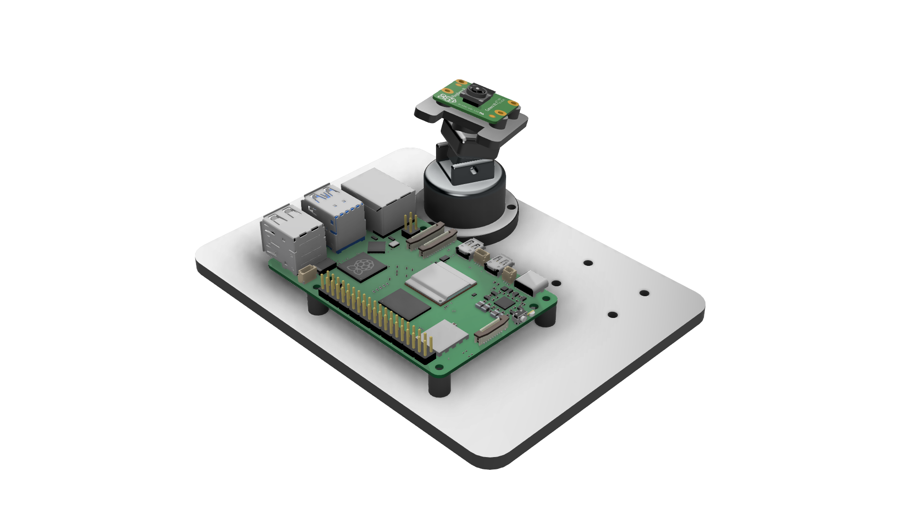
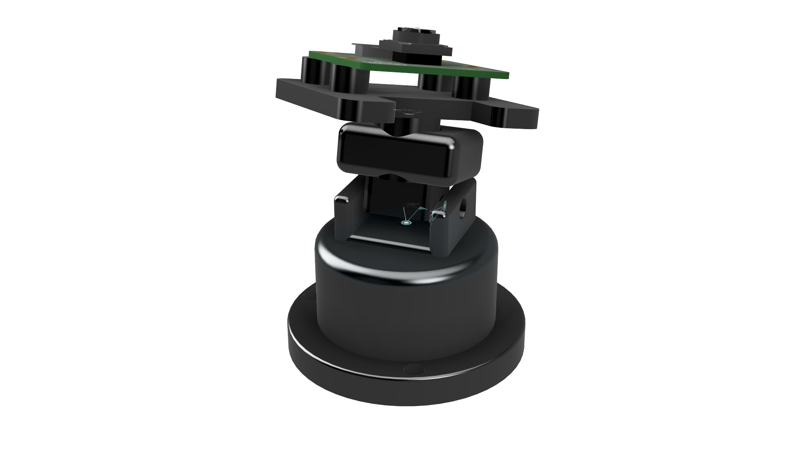
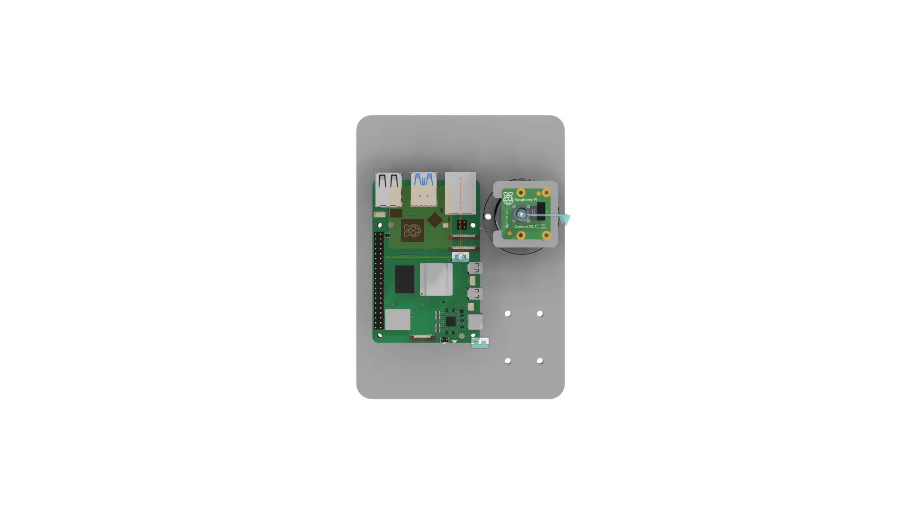

# VITracker 3-DOF Camera Testbench

A mechanical testbench designed for a Raspberry Pi 5 and Raspberry Pi
Camera Module 2. The system provides independent roll, pitch, and yaw
adjustment for camera-based testing.

The project was developed in Autodesk Fusion 360 as part of a mechanical
design onboarding project for UW Reality Labs.

## Overview

The VITracker testbench was designed with an emphasis on mechanical
adjustability, compact packaging, component accessibility, stability,
and 3D-printable construction.

The camera assembly provides three independent rotational degrees of
freedom:

- Yaw: ±90°
- Pitch: ±15°
- Roll: ±45°

The platform also provides secure mounting for a Raspberry Pi 5 and
Raspberry Pi Camera Module 2 while maintaining access to important
connectors and allowing the camera ribbon cable to be routed through
the assembly.

## Design Features

- 3-DOF roll, pitch, and yaw camera positioning
- Raspberry Pi 5 mounted using PCB standoffs
- Raspberry Pi Camera Module 2 integration
- Camera carrier with ribbon cable clearance
- Defined joint motion limits
- M2 and M3 hardware clearances considered during design
- Component accessibility considered during packaging
- Mechanical interference checked throughout the joint range of motion
- Compact camera positioning to improve platform stability
- Additional mounting provisions for future expansion
- Components designed with FDM 3D printing in mind

## Mechanical Architecture

The camera mechanism consists of three nested rotational joints.

### Roll

The Camera Carrier rotates relative to the Roll Block around a
cylindrical shaft.

Range:

-45° to +45°

### Pitch

The Roll Block rotates relative to the Pitch Yoke about an M3-sized
pivot axis.

Range:

-15° to +15°

### Yaw

The Pitch Yoke rotates around the Yaw Pedestal about a vertical
M3-sized pivot axis.

Range:

-90° to +90°

## Hardware

- Raspberry Pi 5
- Raspberry Pi Camera Module V2.1
- M2 mounting hardware
- M3 pivot and mounting hardware
- FDM 3D-printed components

Fasteners are represented through mounting and clearance geometry in
the CAD assembly and are not individually modeled.

## CAD and Design Process

The testbench was developed as a multi-component Autodesk Fusion 360
assembly.

Reference CAD was used for the Raspberry Pi 5 and Raspberry Pi Camera
Module 2 so that the surrounding components could be designed around
realistic mounting geometry and component clearances.

The design process included consideration of:

- PCB mounting geometry
- Fastener clearance
- Rotational range of motion
- Mechanical interference
- Camera ribbon cable routing
- Raspberry Pi port accessibility
- FDM manufacturing constraints
- Platform stability
- Future modular expansion

Joint motion was simulated in Fusion 360 using revolute joints and
defined motion limits.

## Project Images

### Full Assembly

### Camera Mount

### Top View

## Joint Ranges

| Axis | Range |
|---|---|
| Yaw | -90° to +90° |
| Pitch | -15° to +15° |
| Roll | -45° to +45° |

## Joint Demonstration

A Fusion 360 motion demonstration of the three rotational degrees of
freedom is available here:

[View joint demonstration](Images/joint-demonstration.mp4)

## Manufacturing Considerations

The custom mechanical components were designed primarily for FDM
3D printing.

Design considerations included:

- Printable component geometry
- M2/M3 fastener clearances
- PCB standoffs
- Access for assembly and disassembly
- Clearance between moving parts
- Cable routing
- Motion limits to reduce cable twisting
- Stable placement of the camera mechanism on the base

## Repository Structure

- `CAD` — native and neutral CAD files
- `Drawings` — engineering drawings and manufacturing documentation
- `Images` — screenshots and motion demonstration
- `Documentation` — project notes and design documentation

## Status

Mechanical CAD design completed.

Current design includes functional roll, pitch, and yaw joints modeled
and tested within the Fusion 360 assembly.
